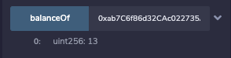

# Crowdsale - PupperCoin
## You sure can attract a crowd!

## Background

Your company has decided to crowdsale their PupperCoin token in order to help fund the network development.
This network will be used to track the dog breeding activity across the globe in a decentralized way, and allow humans to track the genetic trail of their pets. However, you are required to enable refunds if the crowdsale is successful and the goal is met, and you are only allowed to raise a maximum of 300 Ether. The crowdsale will run for 24 weeks.

You will need to create an ERC20 token that will be minted through a `Crowdsale` contract that you can leverage from the OpenZeppelin Solidity library.

This crowdsale contract will manage the entire process, allowing users to send ETH and get back PUP (PupperCoin).
This contract will mint the tokens automatically and distribute them to buyers in one transaction.

It will need to inherit `Crowdsale`, `CappedCrowdsale`, `TimedCrowdsale`, `RefundableCrowdsale`, and `MintedCrowdsale`.

## Instructions

### Creating your project

Using Remix, create a file called `PupperCoin.sol` and create a standard `ERC20Mintable` token. 

Create a new contract named `PupperCoinCrowdsale.sol`, and prepare it like a standard crowdsale.

### Designing the contracts

#### ERC20 PupperCoin

In this section, I have used a standard `ERC20Mintable` and `ERC20Detailed` contract, hardcoding `18` as the `decimals` parameter, and leaving the `initial_supply` parameter alone.

#### PupperCoinCrowdsale

In this section, I needed to bootstrap the contract by inheriting the following OpenZeppelin contracts:

* `Crowdsale`

* `MintedCrowdsale`

* `CappedCrowdsale`

* `TimedCrowdsale`

* `RefundablePostDeliveryCrowdsale`

- I have also provided some parameters for all of the features of my crowdsale, such as the `name`, `symbol`, `wallet` for fundraising, `goal`, etc. 

- I have called the above mentioned constructors that inherit into my the `RefundableCrowdsale` contract.

#### PupperCoinCrowdsaleDeployer

In this contract, I have modelled the deployment accordingly to the specifications needed. 

### Deploying the Crowdsale

Finally, it is ready to be deployed!! I have deuseddeployed my contract using `Injected Web3` to connect the `Ropsten testnet` into `MetaMask` and store the deployed address.

- Successfully deployed:

- Three Contracts deployed:

- Buying some Pupper Tokens:

- Another purchase:

- Confirming the purchase:

- Balance:

- Supply:

